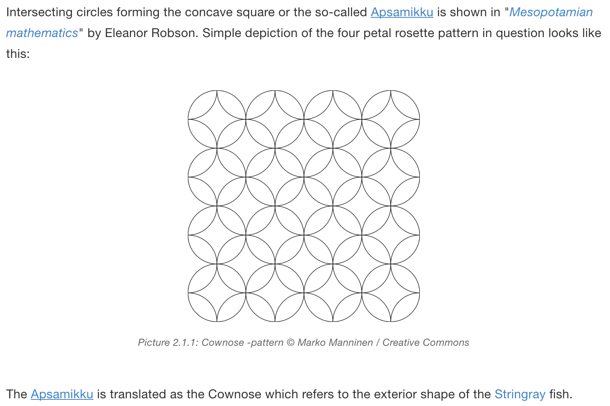

gitbook-plugin-regexplace
==========
General text replacement (RegExp -style) plugin for GitBook projects.

RegExp guide: [https://developer.mozilla.org/en-US/docs/Web/JavaScript/Guide/Regular_Expressions](https://developer.mozilla.org/en-US/docs/Web/JavaScript/Guide/Regular_Expressions)

Usage example
-----

Mark partitions on the page that should not break apart on printing the page or generating the page as a pdf.

Add the ```regexplace``` plugin on the plugins array of your ```book.json``` file and configure appropriate substitutes and texts to replace:

```json
{
	"plugins": ["regexplace"],
	"pluginsConfig": {
		"regexplace": {
			"substitutes": [
				{"pattern": "<!-- nopb -->", "flags": "g", "substitute": "<div class=\"nopb\">"},
				{"pattern": "<!-- endnopb -->", "flags": "g", "substitute": "</div>"}
			]
		}
	}
}
```

Mark page partitions to text (markdown) files:

```markdown
<!-- nopb -->

# Title

Normal content...

> additional text blocks

<!-- endnopb -->
```

This will produce:

```html
<div class="nopb">
<h1>Title</h1>
<p>Normal content...</p>
<quote>additional text blocks</quote>
</div>
```

When above configuration is combined with the following website.css code block, it should prevent page breaks inside partitions, which are defined with div elements having a class ```nopb```:

```css
div.nopb {
    page-break-inside: avoid;	
}
```

Of course this also requires setting some style definitions for website and pdf generation on ```book.json``` similar to:

```json
"styles": {
    "website": "media/website.css",
    "pdf": "media/website.css"
}
```

Other examples
-----

Many other usages can be found for the plugin, because using html code blocks directly on markdown pages often ruins rendering the page. To solve the problem, you have to set comment blocks as described above markdown. Then you can change them to html with substitutes defined on plugin configuration.

Adding more complex container for image
-----

Next example is written with a help of RexExr v2.0 builder: [http://regexr.com/3caon](http://regexr.com/3caon)

```json
{
	"plugins": ["regexplace"],
	"pluginsConfig": {
		"regexplace": {
			"substitutes": [
				{
                   "pattern": " {0,}{caption([^\\}]*)}", 
                   "flags": "g", 
                   "substitute": "<figure id=\"fig_PAGE_LEVEL_._INDEX_\"><figcaption><span>Picture _PAGE_LEVEL_._INDEX_: </span>$2</figcaption></figure>"
                }
			]
		}
	}
}
```

This example also leverages ```_PAGE_LEVEL_``` and ```_INDEX_ ```templates which are replaced by page level information for ```_PAGE_LEVEL_``` and match index value for ```_INDEX_``` in the ```gitbook-plugin-regexplace``` plugin.

Lets assume ```page.md``` has a level 1 and there is content something like this:

```markdown
{caption width=300}

{caption}
```

By using above regex substitutes it will produce output:

```html
<figure id="fig1.1"><figcaption><span>Picture 1.1: </span>Image 1</figcaption></figure>

<figure id="fig1.2"><figcaption><span>Picture 1.2: </span>Image 2</figcaption></figure>
```

Which in turn can be styled with ```website.css``` to get nice image caption and container:

```css
figure {
    margin: 1.5em 0px;
    padding: 10px 0;
    text-align: center;
}

figcaption {
    clear: left;
    margin: 0.75em 0px;
    text-align: center;
    font-style: italic;
    line-height: 1.5em;
    font-size: 80%;
    color: #666;
}
```

Screenshot from my [GitBook project](https://markomanninen.gitbooks.io/artifacts-of-the-flower-of-life/content/cownose.html) shown below:



Counting and listing unique words on book
-----

Good way to do spell checking and text analysis is to count words on document and list them on test page. This can be achieved by regular expressions as well. First define configuration on ```book.json```:

```json
{
	"plugins": ["regexplace"],
	"pluginsConfig": {
		"regexplace": {
			"substitutes": [
				{
                    "pattern": "((?!([^<]+)?>)([0-9A-Za-z\\u0080-\\u00FF'.-]?)+(?!([^{]+)?})([0-9A-Za-z\\u0080-\\u00FF'])?(?!([^&]+)?;)([0-9A-Za-z\\u0080-\\u00FF']))",
                    "flags": "g",
                    "substitute": "$1",
                    "store": {
                        "substitute": "{$1}",
                        "unique": true,
                        "lower": true,
                        "variable_name": "words"
                    }
                }
			]
		}
	}
}
```

By using _PAGE_PATH_ on store substitute we can get information on which page word is used, for example:

```json
"substitute": "{_PAGE_PATH_#$1}"
```

But for now we just want to list all unique words in lower case and sorted alphabetically. Next step is to output words on any page you wish, say ```keywords.md```:


```markdown
# Words

Unique words in the book: {{ book.words.length }}

<hr/>

{{ book.words.sort().join(', ') }}
```

There you must be careful on printing words on the page, because they might also get counted on the final result. I have used output format ```{$1}``` for stored words and discounted them on pattern configuration: ```"pattern": "... (?!([^{]+)?}) ..."```. Also pattern ```"substitute": "$1"``` is important because you could easily replace all words on the book by this method. Here we recover match to the same position with ```$1```.
